
<h1 align="center">的咖啡馆管理系统</h1>

## 简介
咖啡馆管理系统：支持管理员、客户、员工角色；提供登录注册、咖啡信息管理、订单管理、客户管理、购物车、在线客服、地址管理等功能。    --计算机毕业设计源码；毕设源码；java毕业设计源码

## 联系方式

<h3 align="center">获取完整代码与数据库文件 + 微信：deepguan QQ: 86050149 QQ群: 783742310</h3>

<h3 align="center">可帮忙远程部署 包运行成功！提供远程部署、修改代码、设计文档指导、代码讲解等服务！</h3>

## 功能介绍（完整见运行截图）
管理员：基本功能包括管理员身份的登录和退出，能够查看和管理所有用户与员工的账户信息。管理员可用模块涵盖客户管理、员工管理、咖啡类型与咖啡信息管理、订单管理以及系统管理，提供添加、查看、修改及删除操作，支持批量操作。该角色还可管理和维护整个平台的导航栏设置，认可或拒绝用户反馈、疑问与诉求。

用户：用户可以通过用户身份进行注册、登录和退出，访问个人中心查看与修改个人信息，包括修改密码、查看我的订单以及管理我的地址。用户可浏览首页，查看咖啡商品菜单、商品详细信息，还有选择商品添加至购物车并通过结算进行购买。用户还可通过购物车界面管理选购商品的数量、移除不需要的商品，并进行实时在线交流以获取客服帮助。

员工：员工可通过员工身份进行登录，通过系统分配的角色权限访问个人中心，进行对应模块的操作或管理。员工可查看、管理个人相关信息并协助处理客户订单，依据权限进行部分订单操作，如状态更新，订单详情查看与维护客户信息的准确性，协助管理员进行系统信息的更新和协作等，以提高工作效率和服务质量。

## 运行截图
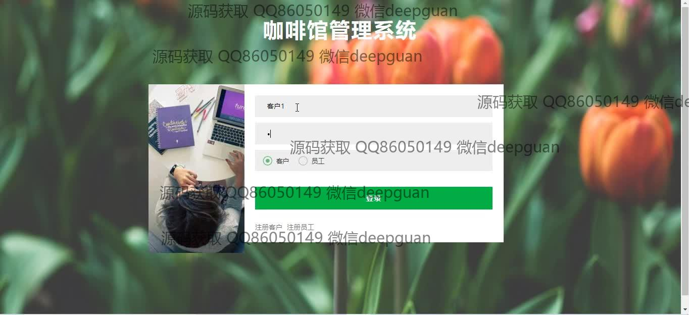
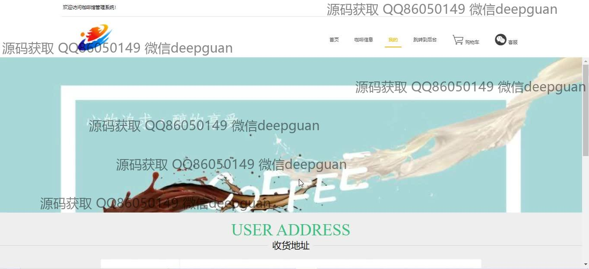
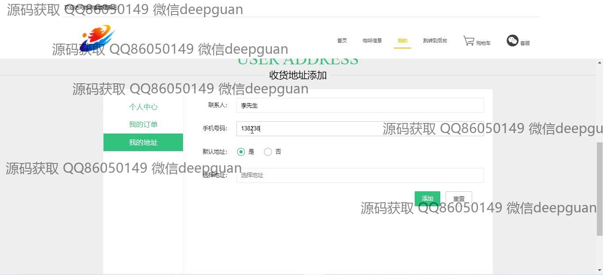
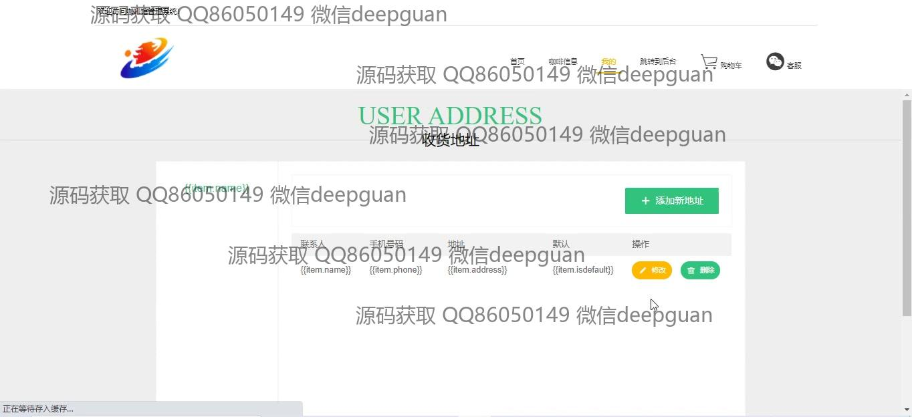

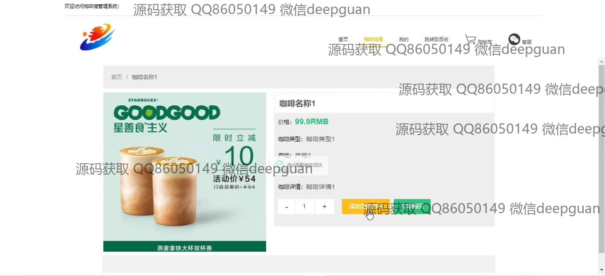
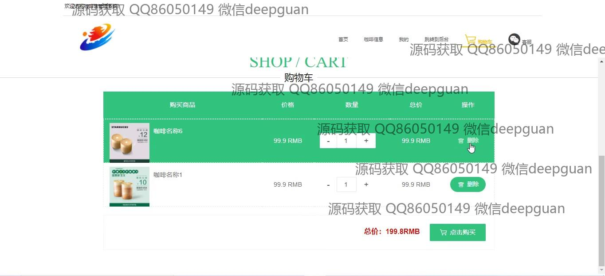
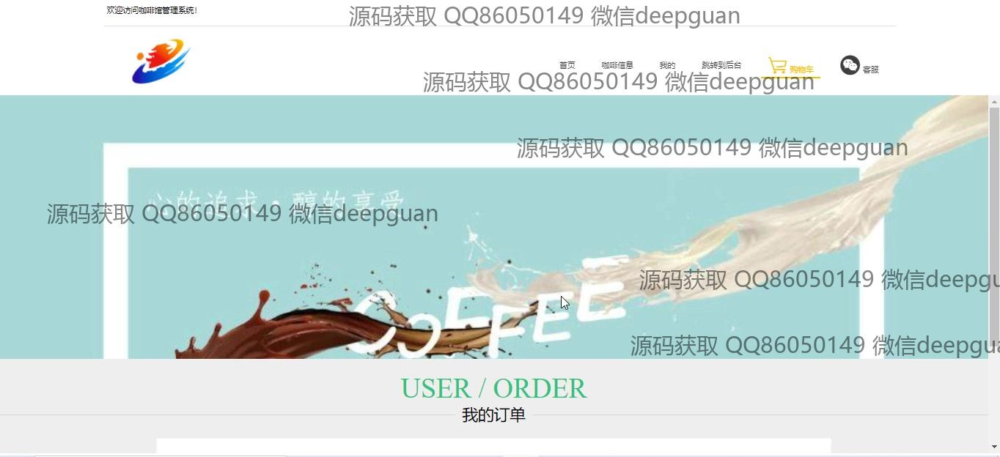
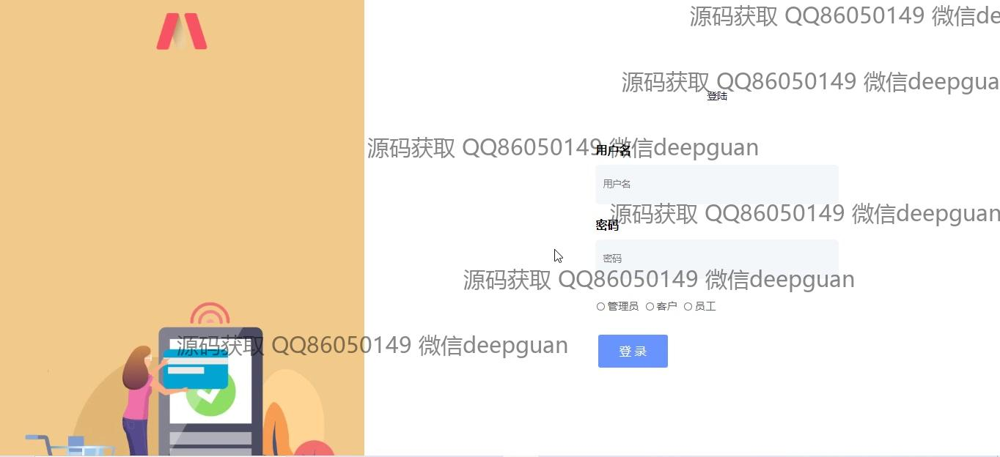
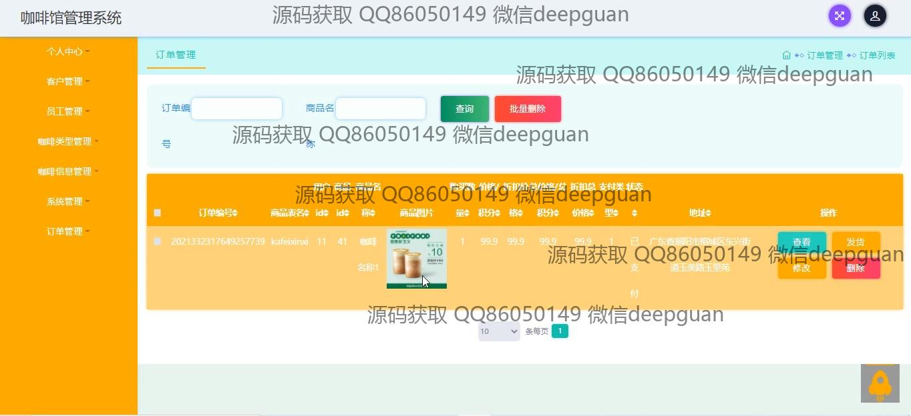
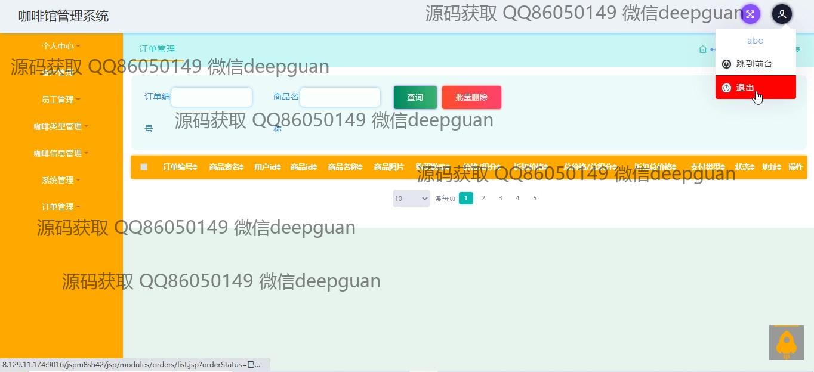
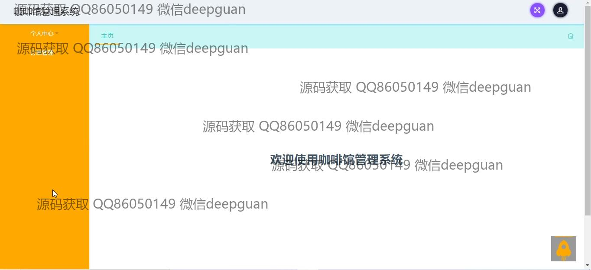
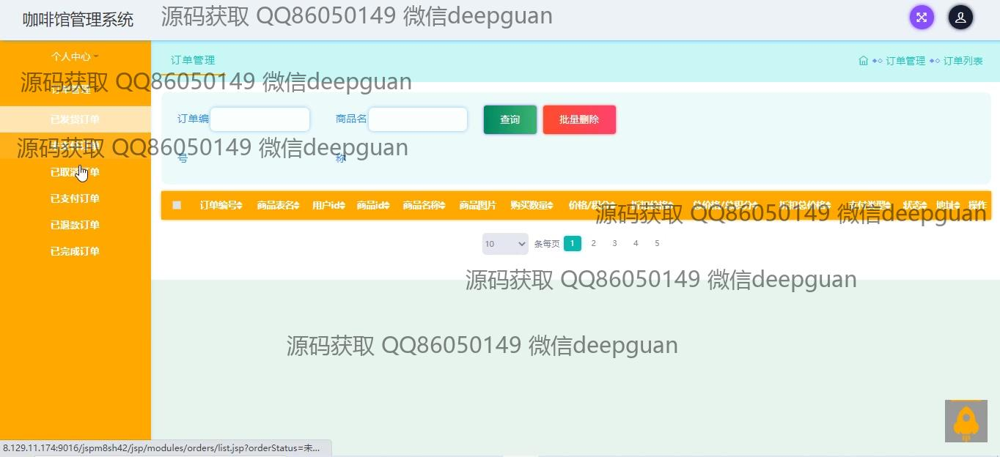
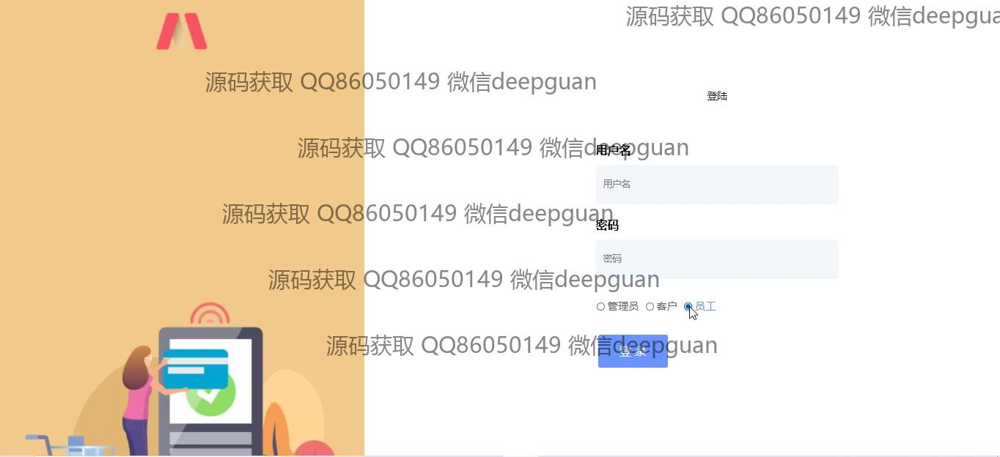
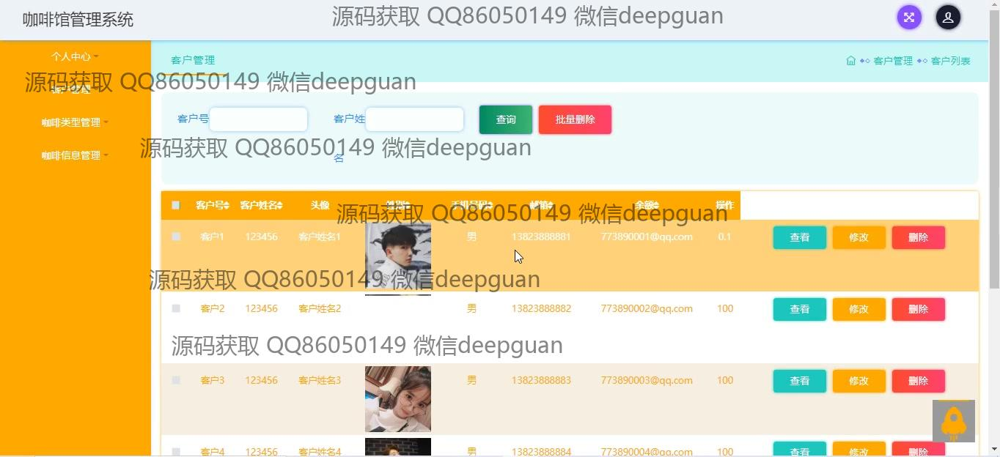
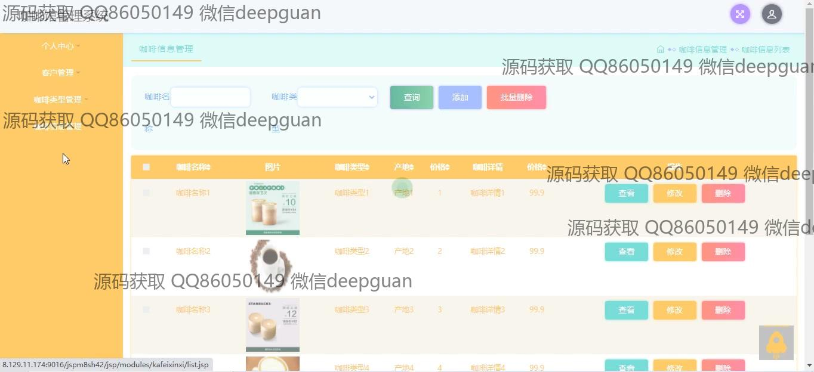
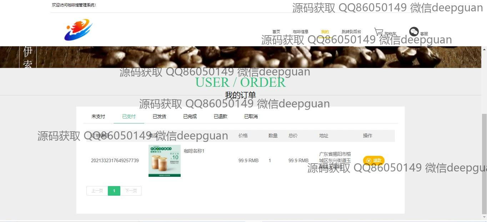
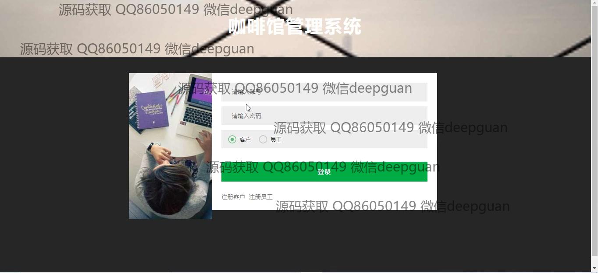
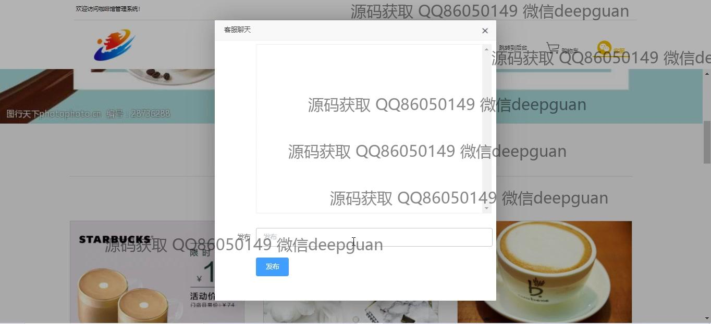
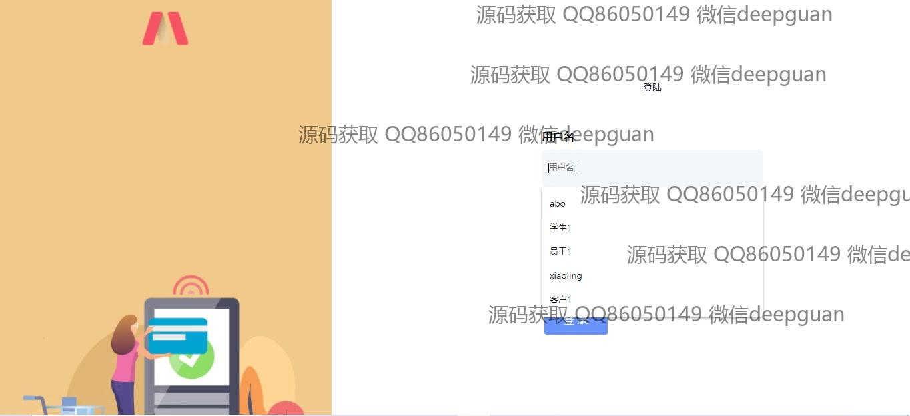
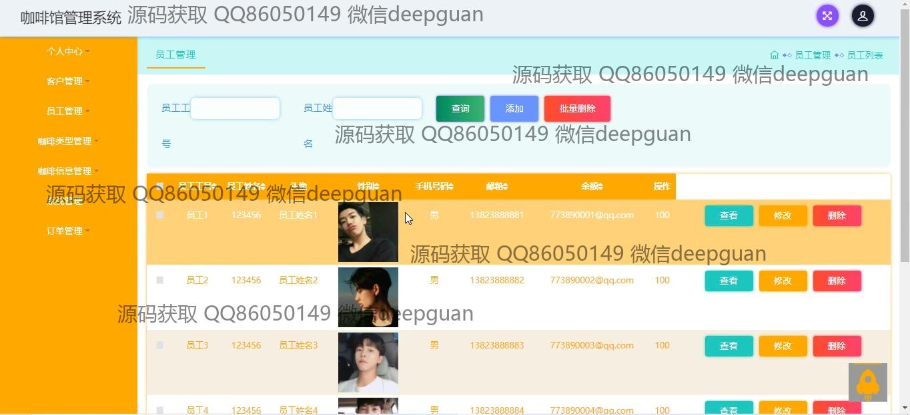
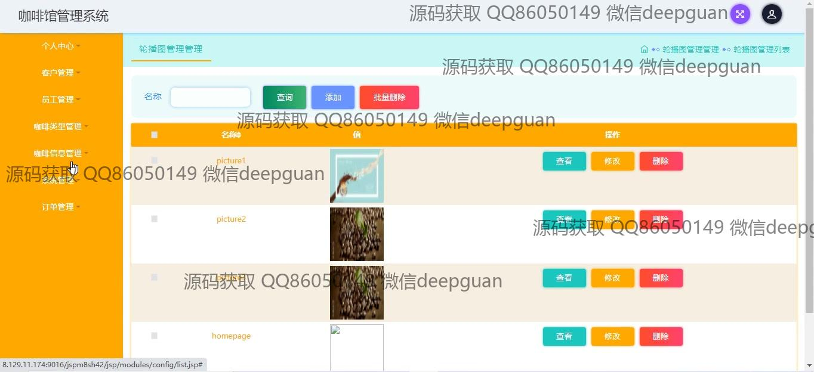

本代码来源于网络,仅供学习参考使用!

